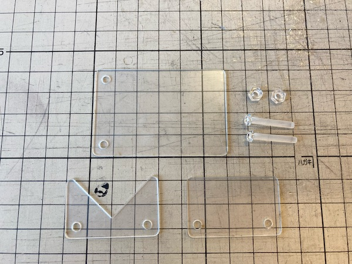
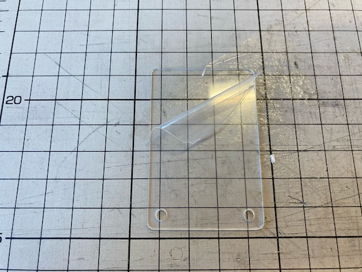
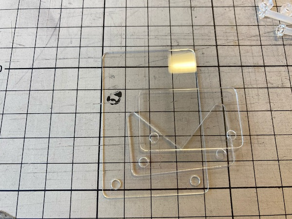
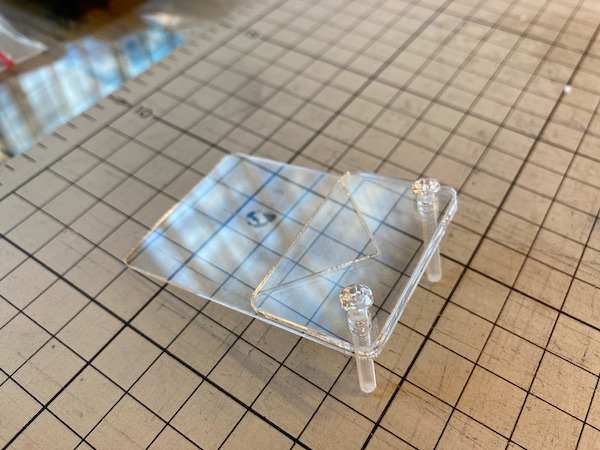
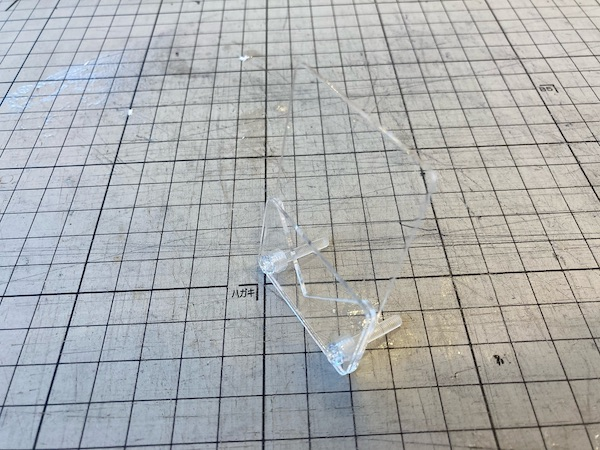

# スタンド

## 組み立て方

1. 3種類の板部品とネジ・ナットが2組そろっていることを確かめる。
    
1. 板部品の保護フィルムをはがす(両面あります)。
    
1. 長い板・V字の板・短い板の順に重ねる。
    
1. 穴位置をそろえてネジを通す。ネジは短い板の面から差します。
    
1. ナットを奥まで締める。
    

## 自分で作る場合

- ネジ: M3 20mm
- ナット: M3
- アクリル板: 板厚1mm

ネジは長さによって角度調節の効果が得られます。秋葉原西川や東急ハンズなどで購入できます。長さ12mmのネジが多いですが、これでは短くひっくり返るかもしれません。

[PDFの図](./Stand_Cut.pdf)に沿って、レーザーカッターでアクリル板をカットしてください。黒→赤の順でカットします。
